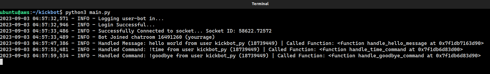

# kickbot

### Unofficial python package to create bots and interact with the kick.com api

---
## Table of Contents

- [About](#about)
- [Installation](#installation)
- [Features](#features)
- [Example](#example)
- [Command / Message handling](#command-and-message-handling)
- [Sending Messages / Reply's](#sending-messages-and-replys)
- [Timed event functions](#timed-events)


---
## About

This package allows you to create bots (user bots) to monitor a stream. 

You will need to set up a 'user bot' account (a normal user account to act as a bot) and disable 2-factor 
authentication for the bot to be able to log in and handle commands / messages.

## Installation
```console
pip install kickbot
```

## Features

Currently supports the following features. More may be added soon, and contributions are more than welcome.

- Command handling: Handle commands, looking for the first word. i.e: ```'!hello'``` 
- Message handling: Handle messages, looking to match the full message. i.e: ```'hello world'```
- Sending messages: Have the bot send a message in chat
- Replying to messages: Reply directly to a users previous message / command.
- Timed events: Set a reoccurring event. i.e: Sending links to socials in chat every 30 minutes.

## Example

---

```python3
from kickbot import KickBot, KickMessage
from datetime import datetime, timedelta


async def handle_hello_message(bot: KickBot, message: KickMessage):
    content = message.content
    sender_username = message.sender.username
    chat_message = f"Hello {sender_username}. Got your message {content}"
    await bot.send_text(chat_message)

    
async def handle_time_command(bot: KickBot, message: KickMessage):
    time = datetime.utcnow()
    reply = f"Current UTC Time: {time}"
    await bot.reply_text(message, reply)

    
async def send_links_in_chat(bot: KickBot):
    links = "Youtube: https://youtube.com\n\nKick: https://kick.com\n\nTwitch: https://kick.com"
    await bot.send_text(links)
    

if __name__ == '__main__':
    USERBOT_EMAIL = "example@domain.com"
    USERBOT_PASS = "Password123"
    STREAMER = "streamer_username"
    
    bot = KickBot(USERBOT_EMAIL, USERBOT_PASS)
    bot.set_streamer(STREAMER)

    bot.add_message_handler('hello world', handle_hello_message)
    bot.add_command_handler('!time', handle_time_command)
    bot.add_timed_event(timedelta(minutes=30), send_links_in_chat)
    
    bot.poll()
```
### Output


<br>

## Command and Message Handling


---
- Handler callback functions must be async
- Command handler looks to match the first word of the message / command.
- Message handler looks to match the full message.

### Paramaters
```python3
bot.add_message_handler('hello world', handle_hello_message)
bot.add_command_handler('!time', handle_time_command)
```

#### Command / Message paramater (type ```str```)

- The command / message to look for 

#### Callback function (type ```Callable```)
- Async callback function for the command  / message to trigger


### Handler Callback function parameters:
```python3
async def handle_hello_command(bot: KickBot, message: KickMessage):...
```


#### Bot parameter (type: ```KickBot```) 

- This will give you access to functions for the bot, such as ```bot.send_text```, and ```bot.reply_text```.
#### Message parameter (type: ```KickMessage```)
- This will give you access to all attributes of the message that triggered the handler. See [KickMessage](/kickbot/kick_message.py) for 
a full list of attributes.

Some useful message attributes include:
```python3
async def hello_handler(bot: KickBot, message: KickMessage):
    content = message.content # main message content
    args = message.args # list of arguments, i.e: ['!hello', 'how', 'are', 'you?']
    message_id = message.id # The uuid of the message
    
    # sender attributes
    sender_username = message.sender.username # username of the sender
    sender_user_id = message.sender.user_id # user ID if the sender
    seder_badges = message.sender.badges # badges of the sender
    
    response = f"Hello {sender_username}"
    await bot.reply_text(message, response)
```
<br>

## Sending Messages and Reply's

Functions mainly to be used inside a callback function, to send a message in chat, or reply to a users message.

### ```bot.send_text(chat_message: str)```

#### Chat Message Paramater: (type: ```str```)

- Message to be sent in chat

<br>

### ```bot.reply_text(message: KickMessage, reply: str)```

#### Message Paramater: (type: ```KickMessage```)

- The Message you want to reply to

#### Reply Paramater: (type: ```str```)

- The Reply to send to the Message

<br>

## Timed Events
Set a reoccurring function to be called, and the frequency to call the function.

i.e: Send links for your socials in chat every 30 minutes

### Parameters
```python3
bot.add_timed_event(timedelta(minutes=30), send_links_in_chat)
```

#### Frequency parameter (type: ```timedelta```)

- The frequency to call the function

#### Callback function (type: ```Callable```)

- Async callback function to be called with the frequency of the parameter above

### Timed Event Callback parameter

```python3
async def send_links_in_chat(bot: KickBot):...
```

#### bot parameter (type: ```KickBot```)

- This will give you access to functions for the bot. For timed events, the most useful 
is ```bot.send_text``` to send a reoccurring message in chat
